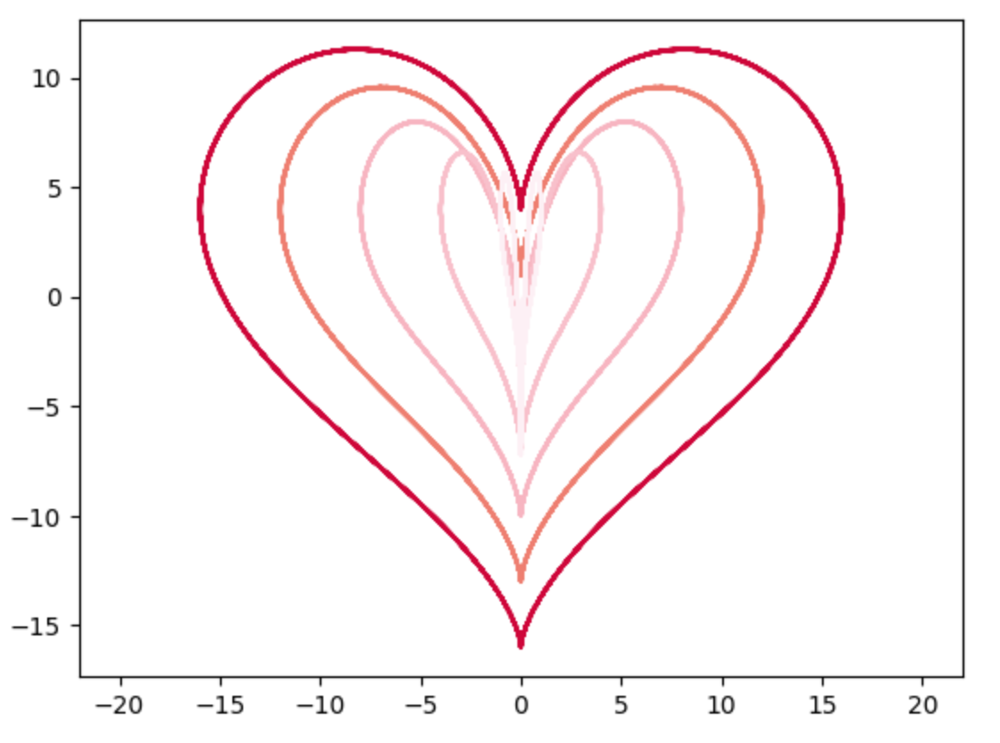
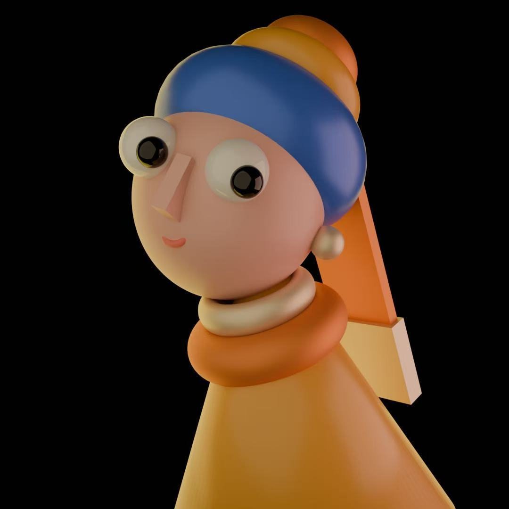

# 仙女不用睡觉のBLOG💤
### WELCOME TO MY BLOG
-----------------------------------------------------
*✨🩵宇宙或是人海，请把我认出来🩵✨*

-----------------------------------------------------
## Myself

 

   >Name:玛丽苏娜云云
   >
   >Gender:🚺
   >
   >🎂:2003 Oct 27th
   >
   >Dream😶‍🌫️:成为想成为的大人⭐
   >
   >Like:🐱🐶🐿️🐇🦔
   >
   >MBIT:ENFP⚛️
   >
   >XMUM 2304 DMT STUDENT
   >
   >Interest:| Poster Design|Video Clip|Draw|手账|

Contect:
Email:PHY2209504@xmu.edu.my

## My Favourite Singer
 

   >Name: 尤长靖 （Azora Chin）
   >
   >🎂: 1994 Sep 19th
   >
   >Songs😶‍🌫️:
>
   >           《昨日青空》
>
   >           《是你想成为的大人吗》
>
   >           《肆无忌惮地爱你》
>
   >           《到时见》
>
   >           《人间四季》

-----------------------------------------------------
   ### Study Achievement
  |Language|
- [x] C++
- [x] C#
- [x] Python
- [ ] Java
- [ ] HTML    
- [ ] JavaScript  

```Pyton
import matplotlib.pyplot as plt
import numpy as np

X = np.linspace(-52, 52, 1314)
x = 16*(np.sin(X))**3
y = 13*np.cos(X) - 5*np.cos(2*X) - 2*np.cos(3*X) - np.cos(4*X)
    
plt.plot( x,y, color = '#FA8072')
plt.xlim(-22,22)
plt.show()
```
 

 |Software|
- [x] Unity3D
- [ ] UE
- [x] Blender
- [x] Maya 

